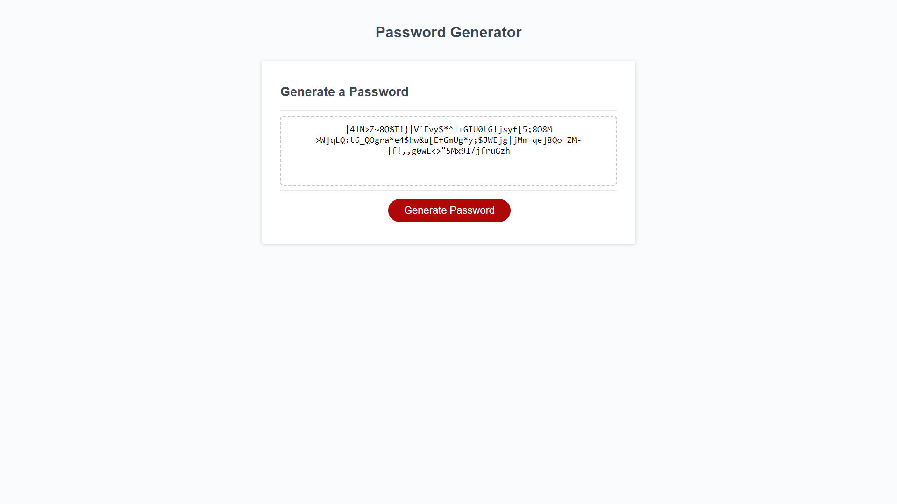

# password generator

## Description

This project uses javascript to generate a password

## Table of Contents 

* [Usage](#usage)

* [License](#license)

* [Screenshot](#screenshot)

* [Links](#links)

* [Questions](#questions)

## Usage
This application is used to generate a passwords

## License

This project is licensed under the MIT license.
  
## Screenshot

## Links
Deployed Link (https://schorij23.github.io/javascript-password-generator/)

## Questions

If you have any questions about the repo, open an issue or contact me directly at schorij23@gmail.com. You can find more of my work at [schorij23](https://github.com/schorij23/).

